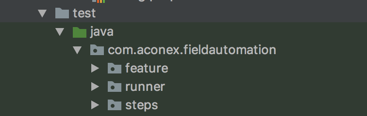
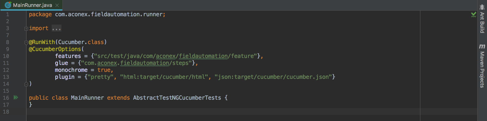

# Field web automation

Java automation framework for Field automation

## Getting Started

These instructions will get you a copy of the project up and running on your local machine for testing purposes. 

### Prerequisites
```
Java JDK 8+ 
Selenium
Docker 
Maven
Cucumber
TestNG
IntelliJ
```

### Installing
```
Java 8+ - https://www.oracle.com/technetwork/java/javase/downloads/jdk8-downloads-2133151.html

Selenium Webdriver -  https://www.seleniumhq.org/download/ 

Standalone server -

    Selenium Client & WebDriver Language Bindings - 
    
	Google ChromeDriver - 
	
IntelliJ - https://www.jetbrains.com/idea/download/#section=mac 

Maven - 

Open Terminal and type 

            $ brew install maven
            $ mvn - indicates whether maven is installed with it’s version number.		


JAVA_HOME Setup - 
		Open Terminal and type 
		$ cd ~/  - to navigate to Home directory
		$ echo $JAVA_HOME - to check whether Java is setup or not, IF NOT then
		$ vim .bash_profile - opens an editor and now type
			export JAVA_HOME=$(/usr/libexec/java_home)
			Press ESC :wq and Hit “Enter”
		$ source .bash_profile
```		
A step by step series of examples that tell you how to get a testing from env running

Screenshot of the Folder structure - 




```
We need to Create a Folder structure as following
	- Feature file - This package contains all the individual feature files used in the project
	- Step File - This package contains all the Step Definition files used for running the Cucumber Feature files 
	- Runner File - Which contains the MainRunner class to run the feature files and tag them along ( Check below to elaborate on MainRunner class file) 
```


## Running the tests

Using MainRunner - Right Click + Run 

MainRunner is the Runner Class which handles the execution of multiple feature files in cucumber

```
@CucumberOptions(
        features = {"src/test/java/com/aconex/fieldautomation/feature"},                            - to run all the feature files
        glue = {"com.aconex.fieldautomation/steps"},                      							- to run all the step files
        monochrome = true,														                    - to display console o/p in a readable way
        plugin = {"pretty", "html:target/cucumber/html", "json:target/cucumber/cucumber.json"}      - to display the reports generated 
)

public class MainRunner extends AbstractTestNGCucumberTests {
}
```
Screenshot attached - 




## From the terminal

```
$./local-build-chrome.sh - To run docker locally

$./quick-build.sh - To run docker locally - headless

$mvn clean test -To run through maven 
```


### Break down into end to end tests


### And coding style

```
1.    Class name example – ClassNameExample
2.    Method name example – methodNameExample
3.    Variable name example – variableNameExample (for multiple word) / Variable – variable (for single word)
```

## Versioning

We use GIT for versioning 
Before working on the repo we create a separate branch and then merge it to the master branch

#### Common Git commands that we use -
```
$git checkout <branchname> 
$git commit -m "messagetobefilled"
$git add <filename>
$git push <branchname>
$git merge 
$git revert <commitid> 
```
## Authors

Field QA Team (Sony, Sesha, Mohan, Sandipan)  

**ReadMe file is work in progress** 